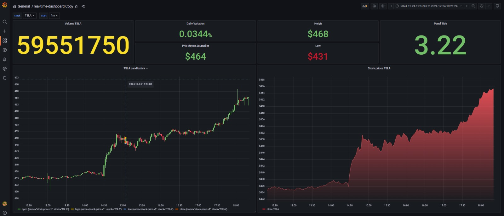

# Projet : Tableau de Bord d'Analytique en Temps Réel avec Apache Spark et Kafka

## 🏗️ Architecture du Projet


---

## 📌 Aperçu du Projet
Ce projet consiste en un pipeline d'analytique en temps réel qui traite des flux de données en direct (ex : cours boursiers via **Yahoo Finance**). Nous utilisons **Apache Kafka** pour l'ingestion des données, **Apache Spark** pour le traitement en temps réel, et **Grafana** pour la visualisation. Les données traitées sont stockées dans **InfluxDB**, une base de données temporelle optimisée pour les séries chronologiques.

---

## 🛠️ Étapes Impliquées

### 1. 🚀 Ingestion des Données avec Kafka
- **Kafka** ingère les données en temps réel via un producteur qui pousse les données dans un topic Kafka.
- Un consommateur Kafka récupère les données pour un traitement ultérieur.

### 2. ⚙️ Traitement en Temps Réel avec Spark
- **Spark Streaming** traite les données en continu (ex : calcul des moyennes mobiles des cours boursiers).
- Les données traitées sont ensuite envoyées à **InfluxDB** pour stockage.

### 3. 📊 Visualisation avec Grafana
- **Grafana** se connecte à **InfluxDB** pour afficher les données en temps réel.
- Exemple de visualisation : graphique linéaire des variations de prix des actions.

---

## 🧩 Technologies Utilisées
- **Yahoo Finance** : Acquisition des données boursières.
- **Kafka** : Ingestion des données en streaming.
- **Zookeeper** : Coordination des services Kafka.
- **Spark** : Traitement des données en temps réel.
- **InfluxDB** : Stockage des données temporelles.
- **Grafana** : Visualisation des données.
- **Docker Compose** : Orchestration des conteneurs.

---

## 🚀 Comment Démarrer
1. **Cloner le dépôt** :
   ```bash
   git clone https://github.com/votre-repo/projet-big-data.git
   cd projet-big-data
   ```
2. **Démarrer les services** :
   ```bash
   docker-compose up -d --build
   ```
3. **Accéder à Grafana** :
   Ouvrez `http://localhost:3000` pour visualiser les données en temps réel.
<div align="center">
  
</div>  

---

## 👥 Contributeurs
- [LAKHLOUFI ISMAIL](https://github.com/ismaillakhloufi) : 
- [AMMI YOUSSEF](https://github.com/youssefammi123/) : 
- [BOURKI ACHRAF](https://github.com/BOURKI970/) : 


---

## 📜 Licence
Ce projet est sous licence MIT. Voir le fichier [LICENSE](LICENSE) pour plus de détails.


---
