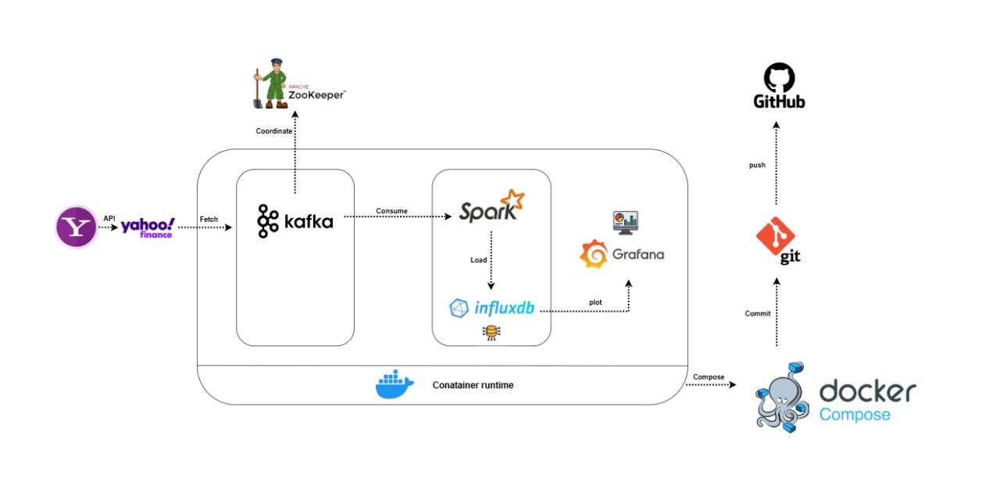

Here’s a tailored README file for your project that incorporates **Kafka**, **Spark**, **InfluxDB**, and **Grafana**. You can copy and paste this into your `README.md` file:

```markdown
# 📊 Real-Time Analytics Dashboard with Apache Kafka, Spark, InfluxDB, and Grafana

<p align="center">
  
</p>
*Real-time data processing and visualization pipeline for actionable insights.*

---

## 📋 Project Overview
This project is a **Real-Time Analytics Dashboard** that leverages **Apache Kafka**, **Apache Spark**, **InfluxDB**, and **Grafana** to process live data streams. With real-time data ingestion, processing, and visualization, the project provides immediate insights through a dynamic dashboard.

### Use Cases:
- **Stock Price Monitoring**: Analyzing price trends in real-time.
- **Social Media Sentiment Analysis**: Tracking popular hashtags and keywords over time.

---

## 🛠️ Key Components
### 1. Data Ingestion with Apache Kafka
- **Kafka** manages the data pipeline by ingesting and distributing real-time data from sources like APIs or social media.
- Kafka producers push data into a topic, while consumers retrieve it for processing.

### 2. Real-Time Data Processing with Apache Spark
- **Spark Streaming** enables continuous computation of data received from Kafka.
- Example tasks include:
  - Calculating moving averages for stock prices.
  - Counting hashtag usage over specified time windows.

### 3. Data Storage with InfluxDB
- **InfluxDB** is used to store time-series data processed by Spark, allowing for efficient queries and analysis of data over time.
- It supports high write rates and is optimized for time-series data.

### 4. Live Dashboard Visualization with Grafana
- The dashboard is created using **Grafana** to visualize the processed data stored in InfluxDB.
- It provides:
  - **Line charts** for real-time trend monitoring of stock prices.
  - **Dynamic panels** to visualize the frequency of trending hashtags.

---

## 🚀 Getting Started

### Prerequisites
Ensure you have the following installed:
- **Docker** (for Kafka, Zookeeper, and InfluxDB containers)
- **Python** and **pip** (for running Spark jobs)

### Installation
1. **Clone the Repository**  
   ```bash
   git clone https://github.com/yourusername/real-time-analytics-dashboard.git
   cd real-time-analytics-dashboard
   ```

2. **Set Up Kafka, Zookeeper, and InfluxDB with Docker**  
   Start Kafka, Zookeeper, and InfluxDB by running:
   ```bash
   docker-compose up -d
   ```
   > *Check the `docker/` directory for Docker configuration details.*

3. **Install Dependencies**  
   Install Python dependencies listed in `requirements.txt`:
   ```bash
   pip install -r requirements.txt
   ```

4. **Start Spark Job**  
   Run the Spark streaming job to begin processing data:
   ```bash
   spark-submit data_processing/streaming_job.py
   ```

5. **Launch Grafana**  
   Access Grafana at `http://localhost:3000` and configure it to read data from InfluxDB.

---

## ⚙️ Project Structure

```plaintext
real-time-analytics-dashboard/
├── data_ingestion/        # Kafka setup and producer scripts
├── data_processing/       # Spark streaming jobs
├── dashboard/             # Grafana dashboard configuration
├── docker/                # Docker configurations for Kafka, Zookeeper, and InfluxDB
├── config/                # Configuration files (Kafka, Spark, InfluxDB, etc.)
├── requirements.txt       # Python dependencies
└── README.md              # Project overview and instructions
```

---

## 📈 Example Visualizations
- **Line Chart**: Live stock price trends over time.
- **Dynamic Panels**: Trending social media hashtags visualized in real-time.

> Screenshots or GIFs showcasing the Grafana dashboard can be added here for a better preview.

---

## 🛠️ Troubleshooting and Tips

- **Handling Data Loss**: Enable Kafka’s built-in fault-tolerance features and Spark checkpointing for data recovery.
- **Scaling**: For larger datasets, consider adjusting Kafka partitions and Spark configurations or using a sample dataset for demonstration.

---

## 👥 Contributors
This project was developed by:
- **[LAKHLOUFI ISMAIL](https://github.com/lakhloufiismail)** - Kafka and Data Ingestion
- **[AMMI YOUSSEF](https://github.com/Youssefammi123)** - Spark Processing
- **[BOURKI ACHRAF](https://github.com/BOURKI970)** - Dashboard Visualization with Grafana

We welcome contributions! See the [contribution guidelines](CONTRIBUTING.md) to get started.

---

## 📄 License
This project is licensed under the MIT License. See the [LICENSE](LICENSE) file for details.

---
```

### Notes:
1. Replace `yourusername` in the clone command with your actual GitHub username.
2. You might want to add screenshots or GIFs of the Grafana dashboard in the "Example Visualizations" section to provide a visual representation of your work.
3. Ensure you include any additional setup instructions specific to Grafana configuration if necessary.

Feel free to modify any sections to better match your project or to add more details as needed! Let me know if you need any further assistance!
